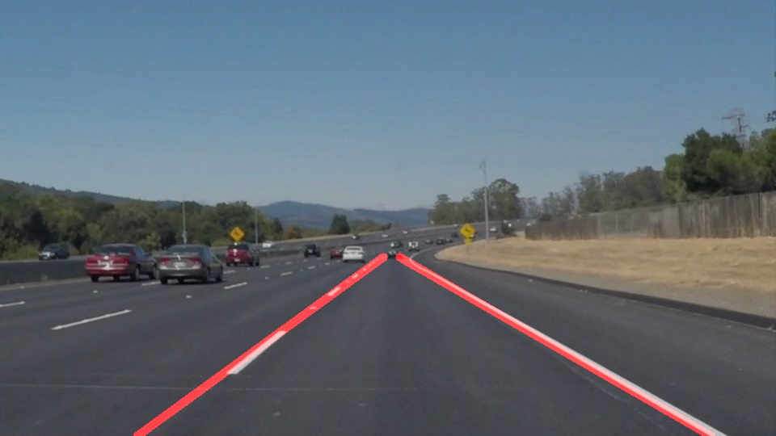

# **Finding Lane Lines on the Road** 
[](http://www.udacity.com/drive)



---

**Finding Lane Lines on the Road**

The goals / steps of this project are the following:
* Make a pipeline that finds lane lines on the road


[//]: # (Image References)

[image2]: ./test_images_output/out_solidWhiteRight.jpg "result2"
[image5]: ./test_images_output/out_solidYellowLeft.jpg "result5"
[short1]: ./test_images_output/short1.png "short1"

---

## 1. Pipeline
The pipeline of this project is as follows:
1. Convert the input image to grayscale
1. Apply gaussian blur to the grayscale image
1. Detect edges in the blurred image using Canny edge detector
1. Mask the out of interest region of the image
1. Detect lines using Hough line detector in the image
1. Choose the longest lines from the left half and the right half region of the image
1. Extrapolate the lines
1. Average the lines using lines on the previous video frames
1. Mix the detected lines and the input image

### Extrapolate line
First, calculate the gradient `a` and the y-intercept `b` from the two vertices of the line.
```python
def calc_line_equation(x1, y1, x2, y2):
    a = (y2 - y1) / (x2 - x1)
    b = y2 - x2 * a
    return a, b
```
Using `a` and `b`, calculate the extrapolated vertices of the line on the bottom of the image and the middle of the image.
```python
def expand_line_down(img, line):
    x1,y1,x2,y2 = line[0]
    a, b = calc_line_equation(x1, y1, x2, y2)
    len_y = img.shape[0]
    bottom_x = int((len_y - b) / a)
    if a < 0:
        return np.array([[bottom_x, len_y, x2, y2]])
    return np.array([[x1, y1, bottom_x, len_y]])
```

### Average line
Save the ~20 lines drawn on the previous video frames to the `deque` and calculate the average of the vertices of the lines.
```python
history_l = deque([], 20)  # lines drawn on the left half
history_r = deque([], 20)  # lines drawn on the right half

def average_line(line, history):
    x1,y1,x2,y2 = line
    for q in history:
        hx1,hy1,hx2,hy2 = q[0]
        x1 += hx1
        y1 += hy1
        x2 += hx2
        y2 += hy2
    s = len(history) + 1
    return [int(x1/s), int(y1/s), int(x2/s), int(y2/s)]
```

### Sample outputs
![Result image 1][image2] ![Result image 2][image5]

## 2. Identify potential shortcomings with the current pipeline
It would be difficult to identify which edges detected would be correct lane lines. For example, in the following image there is a valid straight line on the left half, so that the line detector fails to identify the correct lane line.
![false positive image 1][short1]


## 3. Suggest possible improvements to the pipeline

To use color information of lane lines would be a possible improvement of the pipeline. Limit the angles of the detected lines would be another solution to prevent false positive.
